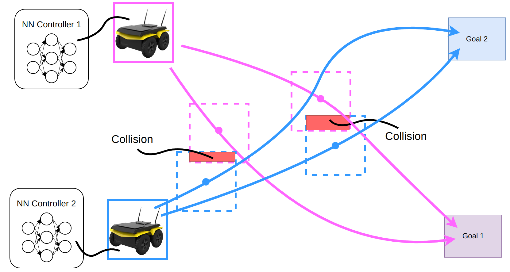
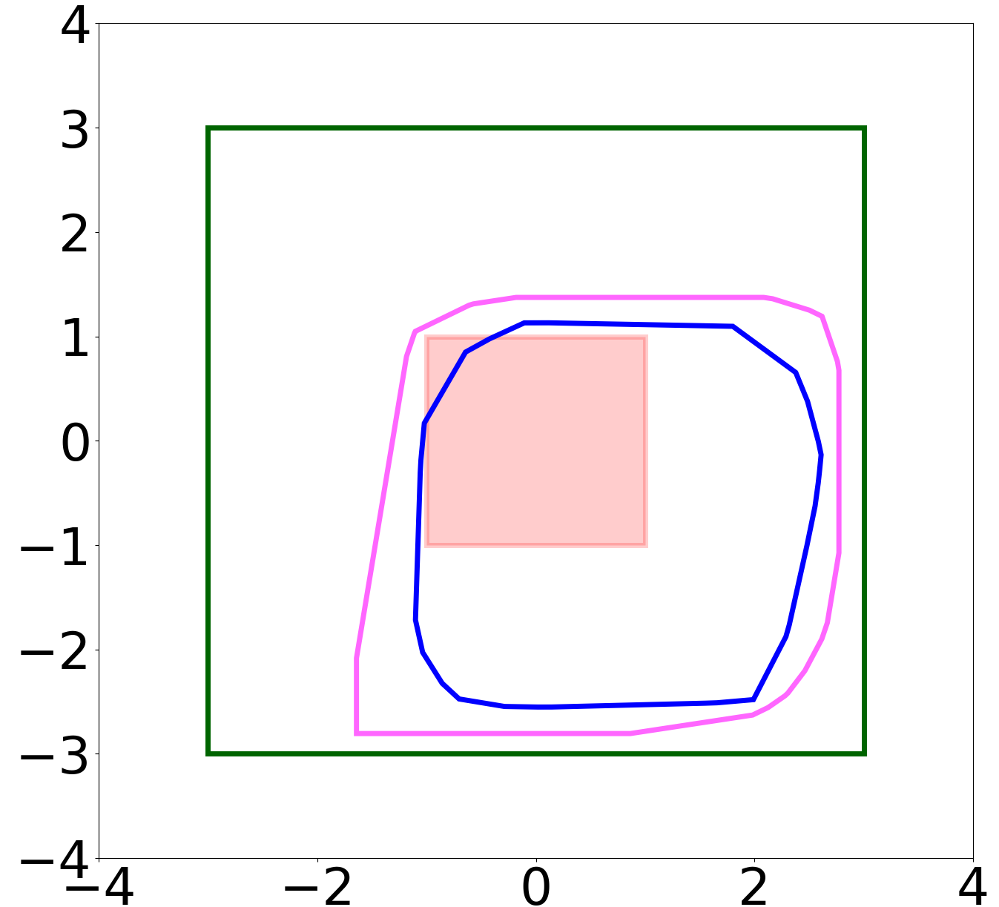
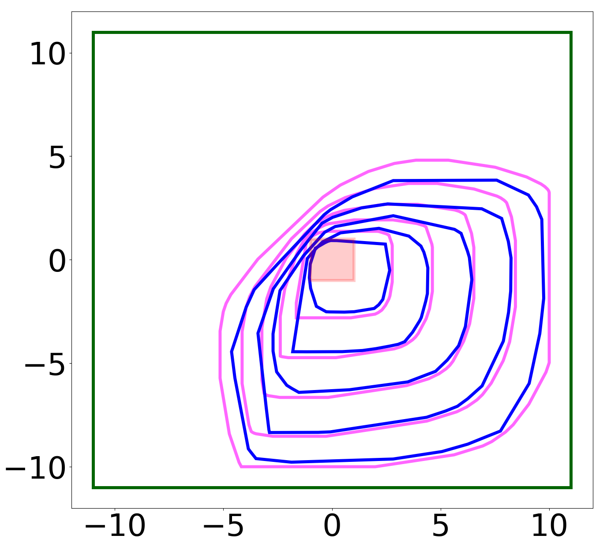

# ReBAR: Relative Backward Reachability Analysis for Multi-agent Neural Feedback Loops (NFL)


<p align="center">
     </br>
    <span>Complex interaction between mutliple neural network controlled agents</span>
</p>

## Updates

* Our paper has been accepted by IEEE Control Systems Letters (L-CSS) and IEEE Conference on Decision and Control (CDC), looking forward to meeting colleagues at Milan this December!

## About

This is the official implementation of the algorithm **ReBAR** proposed in the paper "[Collision Avoidance Verification of Multi-agent Systems with Learned Policies](https://arxiv.org/abs/2403.03314)".
The algorithm computes relative backprojection sets to verify the collision avoidance safety of the given multiagent system.


<p align="center">
    
    
</P>

## Dependencies

This codebase has been tested compatible with the following environment configuration, although other configurations may also work:

* Ubuntu `22.04`
* python `3.8`
* torch `2.1.2`
* cuda `11.8`
* gurobipy `10.0.0`
* [pypoman](https://github.com/stephane-caron/pypoman) `1.0.0`

To install `gurobipy`, please refer to this [page](https://support.gurobi.com/hc/en-us/articles/360044290292-How-do-I-install-Gurobi-for-Python), and to obtain a free academic license, please follow instructions [here](https://www.gurobi.com/academia/academic-program-and-licenses/).

## Usage

### Training

We provide training scripts for networks we verified in the paper, namely single/double integrator RVO policy and potential field policy.

In this implementation we support verifying 2 agent RVO policies and n-agent potential field policies.

To train RVO policies, run the following command. Note because the RVO implementation we found online is non-batchifiable, first training might take some time to generate training data by running simulations in RVO.

```
// Single integrator
python -m model.train.train_RVO --goal_1_x 9.0 --goal_1_y 5.0 --goal_2_x 5.0 --goal_2_y 9.0 \
    --save_path model/checkpoints/single_integrator \
    --batch_size 32 --lr 1e-4 --weight_decay 1e-4 --epoch 20

// Double integrator
python -m model.train.train_RVO --goal_1_x 9.0 --goal_1_y 5.0 --goal_2_x 5.0 --goal_2_y 9.0 \
    --save_path model/checkpoints/double_integrator \
    --batch_size 32 --lr 1e-4 --weight_decay 1e-4 --epoch 20 \
    --double_integ
```

To train potential field policies (refer to this [paper](https://arxiv.org/pdf/2204.08319.pdf) for further information about the policy), run the following command:

```
python -m model.train.train_potential_field \
    --hidden_dim_1 20 --hidden_dim_2 20 \
    --save_path model/checkpoints/potential_field \
    --total_agent_num 10 \
    --batch_size 32 --lr 1e-4 --weight_decay 1e-4 --epoch 20
```

Some pretrained checkpoints can be found in `model/checkpoints/`.

### Verification

To verify the trained policies, run the following command. To get the monte carlo sampled RBPUA, pass in the `--RBPUA` flag. To plot the results, pass in the `--plot` flag.

```
// Single Integrator
python run_single_integrator.py \
    --lb_x 0.0 --lb_y 0.0 --ub_x 10.0 --ub_y 10.0 \
    -r 1.0 --num_cs 20 \
    --hidden_dim_1 10 --hidden_dim_2 10 \
    --checkpoint_1 path/to/agent1/checkpoint \
    --checkpoint_2 path/to/agent2/checkpoint \
    --state_uncertainty 0.5 \
    --steps 5 \
    --RBPUA --plot

// Double Integrator
python run_double_integrator.py \
    --lb_x 0.0 --lb_y 0.0 --ub_x 10.0 --ub_y 10.0 \
    -r 1.0 --num_cs 20 \
    --hidden_dim_1 10 --hidden_dim_2 10 \
    --checkpoint_1 path/to/agent1/checkpoint \
    --checkpoint_2 path/to/agent2/checkpoint \
    --state_uncertainty 0.5 \
    --RBPUA --plot

// Potential Field
python run_potential_field.py \
    --lb_x -10.0 --lb_y -10.0 --ub_x 10.0 --ub_y 10.0 \
    --num_agents 10 -r 1.0 --num_cs 20 \
    --hidden_dim_1 20 --hidden_dim_2 20 \
    --checkpoint_dir /dir/containing/all/agent/checkpoints \
    --state_uncertainty 0.5 \
    --RBPUA --plot
```

## Acknowledgments

We thank the authors of third-party library [pypoman](https://github.com/stephane-caron/pypoman) for their impressive work.

## Bibtex

If you find this work helpful, please consider citing our work:

```
@article{dong2024collision,
  title={Collision Avoidance Verification of Multiagent Systems with Learned Policies},
  author={Dong, Zihao and Omidshafiei, Shayegan and Everett, Michael},
  journal={arXiv preprint arXiv:2403.03314},
  year={2024}
}
```
